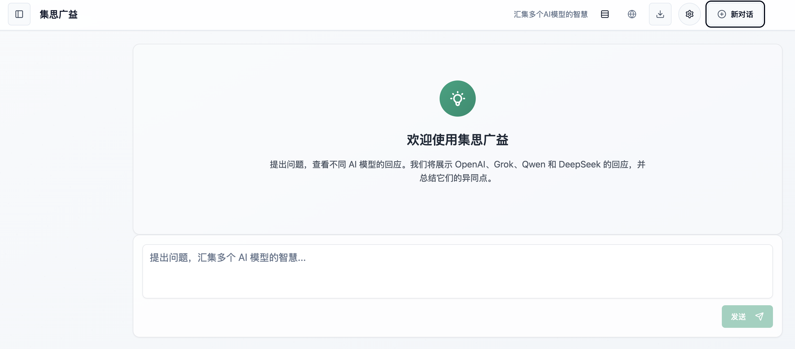

# Thinking - AI Model Comparison Platform


[中文文档](README_CN.md) | [English](README.md)

Thinking is an interactive web platform that allows users to compare responses from multiple leading AI models side by side. By entering a single prompt, users can simultaneously query OpenAI, Grok, Qwen, and DeepSeek models, and receive a comprehensive summary highlighting similarities, differences, key insights, and limitations across the responses.

## Why Thinking?

- **Compare Multiple AI Models**: See how different AI models approach the same question
- **Identify Strengths and Weaknesses**: Understand which model excels at which types of tasks
- **Save Time**: Query multiple models with a single prompt
- **Get Comprehensive Insights**: Receive an AI-generated summary comparing all responses
- **Model Selection**: Choose which specific models to query with the @ mention feature

## Project Structure

- **Frontend**: Built with React/Vite and Tailwind CSS
- **Backend**: FastAPI (Python) for API proxy and model integration

## Setup and Installation

### Backend Setup

1. Navigate to the backend directory:
   ```bash
   cd backend
   ```

2. Create a virtual environment (optional but recommended):
   ```bash
   python -m venv venv
   source venv/bin/activate  # On Windows: venv\Scripts\activate
   ```

3. Install dependencies:
   ```bash
   pip install -r requirements.txt
   ```

4. Create a `.env` file by copying the `.env.example` file:
   ```bash
   cp .env.example .env
   ```

5. Edit the `.env` file and add your API keys for OpenAI, Grok, Qwen, and DeepSeek.

   The application uses environment variables for all configuration. Here are the available environment variables:

   ```
   # Environment
   THINKING_ENV=dev  # Can be dev, test, or prd

   # API Keys
   OPENAI_API_KEY=your_openai_api_key
   GROK_API_KEY=your_grok_api_key
   QWEN_API_KEY=your_qwen_api_key
   DEEPSEEK_API_KEY=your_deepseek_api_key

   # API URLs (optional, defaults are provided)
   OPENAI_API_URL=https://api.openai.com/v1/chat/completions
   GROK_API_URL=https://api.x.ai/v1
   QWEN_API_URL=https://dashscope.aliyuncs.com/compatible-mode/v1
   DEEPSEEK_API_URL=https://api.deepseek.com

   # Models (optional, defaults are provided)
   OPENAI_MODEL=gpt-4o-mini
   GROK_MODEL=grok-2-latest
   QWEN_MODEL=qwen-plus
   DEEPSEEK_MODEL=deepseek-chat

   # Server Configuration
   SERVER_HOST=localhost
   SERVER_PORT=8000
   SERVER_DEBUG=true  # Set to false in production
   LOG_LEVEL=debug    # Can be debug, info, warning, error
   ```

### Frontend Setup

1. Navigate to the frontend directory:
   ```bash
   cd frontend
   ```

2. Install dependencies:
   ```bash
   npm install
   ```

3. Start the development server:
   ```bash
   npm run dev
   ```

## Running the Application

1. Start the backend server:
   ```bash
   cd backend
   uvicorn main:app --reload --host 0.0.0.0 --port 8000
   ```

2. In a separate terminal, start the frontend development server:
   ```bash
   cd frontend
   npm run dev
   ```

3. Access the application in your browser at `http://localhost:5173`

## Key Features

- **Multi-Model Comparison**: Get responses from OpenAI, Grok, Qwen, and DeepSeek with a single prompt
- **Intelligent Summaries**: AI-generated analysis highlighting:
  - Common points shared across models
  - Unique perspectives and differences
  - Key insights from each response
  - Limitations and challenges identified
- **Model Selection**: Use @mentions to select specific models (e.g., @openai @grok)
- **Conversation Memory**: Models remember previous exchanges for contextual responses
- **Streaming Responses**: Real-time streaming with a natural typing effect
- **Conversation History**: All conversations are saved locally in your browser
- **Multiple Layouts**: Choose between different viewing layouts (default, grid, compact)
- **Markdown Support**: Full markdown rendering for code blocks, tables, and more
- **Mobile Responsive**: Works on desktop, tablet, and mobile devices
- **Dark/Light Mode**: Support for system theme preferences

## API Endpoints

### Model Endpoints
- `POST /api/chat/openai` - Query the OpenAI model
- `POST /api/chat/grok` - Query the Grok model
- `POST /api/chat/qwen` - Query the Qwen model
- `POST /api/chat/deepseek` - Query the DeepSeek model

### Summary Endpoint
- `POST /api/summary` - Generate a comparison summary of multiple AI responses

### Configuration Endpoints
- `GET /api/current-environment` - Get current environment configuration
- `POST /api/reload-config` - Reload configuration from environment variables
- `POST /api/switch-environment/{env}` - Switch between dev/test/prd environments

### Logging Endpoints
- `GET /api/logs/level` - Get current log level
- `POST /api/logs/level/{level}` - Set log level (debug, info, warning, error, critical)

### Utility Endpoints
- `GET /api/health` - Health check endpoint with environment and log level information

## Technologies Used

### Frontend
- **Framework**: React with TypeScript
- **Build Tool**: Vite
- **Styling**: Tailwind CSS
- **UI Components**: shadcn/ui
- **State Management**: React Context API
- **HTTP Client**: Fetch API with streaming support
- **Markdown Rendering**: react-markdown with remark-gfm

### Backend
- **Framework**: FastAPI
- **Language**: Python 3.10+
- **HTTP Client**: httpx for async requests
- **Environment Management**: python-dotenv
- **Logging System**: Comprehensive logging with rotation and archiving
- **API Integration**: OpenAI, Grok (X.AI), Qwen (Alibaba), DeepSeek

## Screenshots



## Project Roadmap

- [ ] Add support for more AI models (Claude, Gemini, etc.)
- [ ] Implement user accounts and cloud sync
- [ ] Add collaborative features for team usage
- [ ] Develop analytics to track model performance
- [ ] Create export options (PDF, Markdown, etc.)

## Contributing

Contributions are welcome! Please feel free to submit a Pull Request.

## License

This project is licensed under the MIT License - see the LICENSE file for details.
