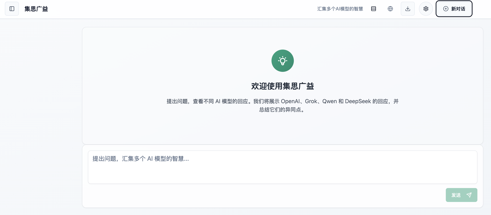

# Thinking - AI 模型比较平台


Thinking 是一个交互式网络平台，允许用户并排比较多个领先 AI 模型的响应。通过输入单个提示，用户可以同时查询 OpenAI、Grok、Qwen 和 DeepSeek 模型，并获得全面的摘要，突出显示各个响应之间的相似之处、差异、关键见解和局限性。

## 为什么选择 Thinking？

- **比较多个 AI 模型**：了解不同 AI 模型如何处理相同问题
- **识别优势和劣势**：了解哪个模型在哪类任务中表现出色
- **节省时间**：使用单个提示查询多个模型
- **获取全面见解**：接收比较所有响应的 AI 生成摘要
- **模型选择**：使用 @ 提及功能选择要查询的特定模型

## 项目结构

- **前端**：使用 React/Vite 和 Tailwind CSS 构建
- **后端**：FastAPI (Python) 用于 API 代理和模型集成

## 设置和安装

### 后端设置

1. 导航到后端目录：
   ```bash
   cd backend
   ```

2. 创建虚拟环境（可选但推荐）：
   ```bash
   python -m venv venv
   source venv/bin/activate  # 在 Windows 上：venv\Scripts\activate
   ```

3. 安装依赖项：
   ```bash
   pip install -r requirements.txt
   ```

4. 通过复制 `.env.example` 文件创建 `.env` 文件：
   ```bash
   cp .env.example .env
   ```

5. 编辑 `.env` 文件并添加 OpenAI、Grok、Qwen 和 DeepSeek 的 API 密钥。

   应用程序使用环境变量进行所有配置。以下是可用的环境变量：

   ```
   # 环境
   THINKING_ENV=dev  # 可以是 dev、test 或 prd

   # API 密钥
   OPENAI_API_KEY=your_openai_api_key
   GROK_API_KEY=your_grok_api_key
   QWEN_API_KEY=your_qwen_api_key
   DEEPSEEK_API_KEY=your_deepseek_api_key

   # API URL（可选，提供默认值）
   OPENAI_API_URL=https://api.openai.com/v1/chat/completions
   GROK_API_URL=https://api.x.ai/v1
   QWEN_API_URL=https://dashscope.aliyuncs.com/compatible-mode/v1
   DEEPSEEK_API_URL=https://api.deepseek.com

   # 模型（可选，提供默认值）
   OPENAI_MODEL=gpt-4o-mini
   GROK_MODEL=grok-2-latest
   QWEN_MODEL=qwen-plus
   DEEPSEEK_MODEL=deepseek-chat

   # 服务器配置
   SERVER_HOST=localhost
   SERVER_PORT=8000
   SERVER_DEBUG=true  # 在生产环境中设置为 false
   LOG_LEVEL=debug    # 可以是 debug、info、warning、error
   ```

### 前端设置

1. 导航到前端目录：
   ```bash
   cd frontend
   ```

2. 安装依赖项：
   ```bash
   npm install
   ```

3. 启动开发服务器：
   ```bash
   npm run dev
   ```

## 运行应用程序

1. 启动后端服务器：
   ```bash
   cd backend
   uvicorn main:app --reload --host 0.0.0.0 --port 8000
   ```

2. 在单独的终端中，启动前端开发服务器：
   ```bash
   cd frontend
   npm run dev
   ```

3. 在浏览器中访问 `http://localhost:5173` 的应用程序

## 主要功能

- **多模型比较**：通过单个提示获取 OpenAI、Grok、Qwen 和 DeepSeek 的响应
- **智能摘要**：AI 生成的分析，突出显示：
  - 模型之间共享的共同点
  - 独特的观点和差异
  - 每个响应的关键见解
  - 识别的局限性和挑战
- **模型选择**：使用 @提及 选择特定模型（例如，@openai @grok）
- **对话记忆**：模型记住之前的交流，以提供上下文相关的响应
- **流式响应**：具有自然打字效果的实时流式传输
- **对话历史**：所有对话都本地保存在您的浏览器中
- **多种布局**：在不同的查看布局之间选择（默认、网格、紧凑）
- **Markdown 支持**：完整的 markdown 渲染，支持代码块、表格等
- **移动响应式**：适用于桌面、平板和移动设备
- **暗/亮模式**：支持系统主题偏好

## API 端点

### 模型端点
- `POST /api/chat/openai` - 查询 OpenAI 模型
- `POST /api/chat/grok` - 查询 Grok 模型
- `POST /api/chat/qwen` - 查询 Qwen 模型
- `POST /api/chat/deepseek` - 查询 DeepSeek 模型

### 摘要端点
- `POST /api/summary` - 生成多个 AI 响应的比较摘要

### 配置端点
- `GET /api/current-environment` - 获取当前环境配置
- `POST /api/reload-config` - 从环境变量重新加载配置
- `POST /api/switch-environment/{env}` - 在 dev/test/prd 环境之间切换

### 日志端点
- `GET /api/logs/level` - 获取当前日志级别
- `POST /api/logs/level/{level}` - 设置日志级别（debug、info、warning、error、critical）

### 实用端点
- `GET /api/health` - 带有环境和日志级别信息的健康检查端点

## 使用的技术

### 前端
- **框架**：React 与 TypeScript
- **构建工具**：Vite
- **样式**：Tailwind CSS
- **UI 组件**：shadcn/ui
- **状态管理**：React Context API
- **HTTP 客户端**：支持流式传输的 Fetch API
- **Markdown 渲染**：带有 remark-gfm 的 react-markdown

### 后端
- **框架**：FastAPI
- **语言**：Python 3.10+
- **HTTP 客户端**：用于异步请求的 httpx
- **环境管理**：python-dotenv
- **日志系统**：全面的日志系统，支持日志轮替和归档
- **API 集成**：OpenAI、Grok (X.AI)、Qwen (阿里巴巴)、DeepSeek

## 截图



## 项目路线图

- [ ] 添加对更多 AI 模型的支持（Claude、Gemini 等）
- [ ] 实现用户账户和云同步
- [ ] 为团队使用添加协作功能
- [ ] 开发分析以跟踪模型性能
- [ ] 创建导出选项（PDF、Markdown 等）

## 贡献

欢迎贡献！请随时提交拉取请求。

## 许可证

该项目根据 MIT 许可证授权 - 有关详细信息，请参阅 LICENSE 文件。
